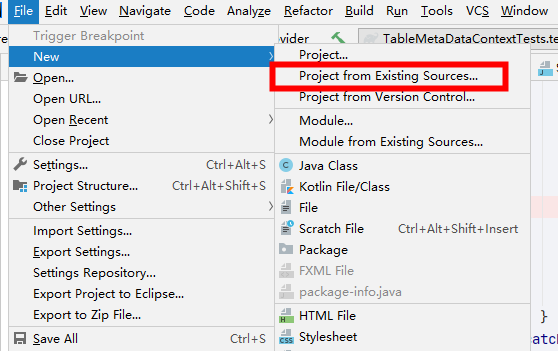
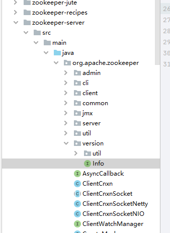
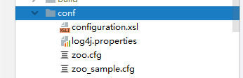

# Zookeeper 源码环境搭建
- 3.6.0之前
## 准备工作

- [ANT](http://ant.apache.org/) 
- [Maven](https://maven.apache.org/)
- [zookeeper源码仓库](https://github.com/apache/zookeeper)


## 执行


### 第一步

1. 执行 **`ant eclipse`**,看到下面这个输出就是构建成功了**BUILD SUCCESSFUL**

   ```
   [ivy:cachepath] :: resolution report :: resolve 1766ms :: artifacts dl 42ms
           ---------------------------------------------------------------------
           |                  |            modules            ||   artifacts   |
           |       conf       | number| search|dwnlded|evicted|| number|dwnlded|
           ---------------------------------------------------------------------
           |       test       |   63  |   0   |   0   |   0   ||   63  |   0   |
           ---------------------------------------------------------------------
     [eclipse] Writing the preferences for "org.eclipse.jdt.core".
     [eclipse] Writing the preferences for "org.eclipse.core.resources".
     [eclipse] Writing the project definition in the mode "java".
     [eclipse] Writing the classpath definition.
   
   BUILD SUCCESSFUL
   
   ```

   

### 第二步

1. 导入IDEA工程

   

   

2. 制作接口`org.apache.zookeeper.version.Info`,生成工具`org.apache.zookeeper.version.util.VerGen` ，新建一个java工程执行它。传递三个参数

   1. 版本
   2. rev
   3. 时间（年月日）

   执行完成后会在项目根目录下看到

   

   拷贝到我们的zookeeper源码工程中

   

### 第三步

启动服务端`org.apache.zookeeper.server.ZooKeeperServerMain`

直接启动抛出下面提示

```
log4j:WARN No appenders could be found for logger (org.apache.zookeeper.jmx.ManagedUtil).
log4j:WARN Please initialize the log4j system properly.
log4j:WARN See http://logging.apache.org/log4j/1.2/faq.html#noconfig for more info.
Usage: ZooKeeperServerMain configfile | port datadir [ticktime] [maxcnxns]
```

- 需要参数，端口，数据文件存放位置

查看**conf**文件夹



复制`zoo_sample.cfg`并替换名称`zoo.cfg`


```
log4j:WARN No appenders could be found for logger (org.apache.zookeeper.jmx.ManagedUtil).
log4j:WARN Please initialize the log4j system properly.
log4j:WARN See http://logging.apache.org/log4j/1.2/faq.html#noconfig for more info.

```


**注意**

- windows 用户请替换**dataDir**地址，默认是Linux的地址