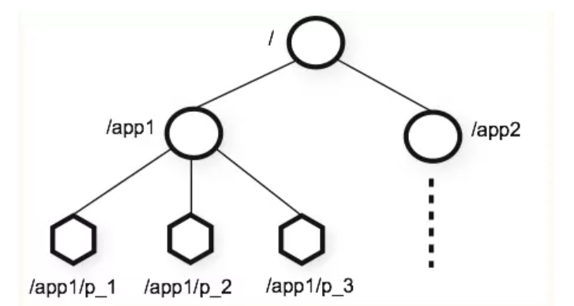

# zookeeper 重要概念
## Session
- Session 是指客户端会话 , 客户端在启动时会与 zookeeper 服务器创建一个长连接(TCP) , 通过第一次连接创建后客户端会话的生命周期也开始了
通过这个连接客户端能够通过心跳检测来与服务器保持有效会话 , 也能够向服务器发送请求并接受响应

## znode
- ZooKeeper命名空间内部拥有一个树状的内存模型，其中各节点被称为znode。每个znode包含一个路径和与之相关的元数据，以及该znode下关联的子节点列表。

## watcher 机制
- zookeeper 通过 watcher 机制实现了发布订阅模式. 一个发布者能够让多个订阅者同时监听某一主题对象, 当这个主题对象状态发送变化会通知订阅者做出处理

## ACL
- Access Control List 访问控制列表，用于控制资源的访问权限 , 这是zookeeper数据安全的保障,zk 通过ACL策略控制znode节点的访问权限(读取数据,写入数据,创建节点,删除节点...)
- ACL的维度
    1. 组
    1. 权限
- znode 没有ACL继承,每个znode都是独立权限控制,只有客户端满足zonde的设置(修改)权限时才可以进行操作